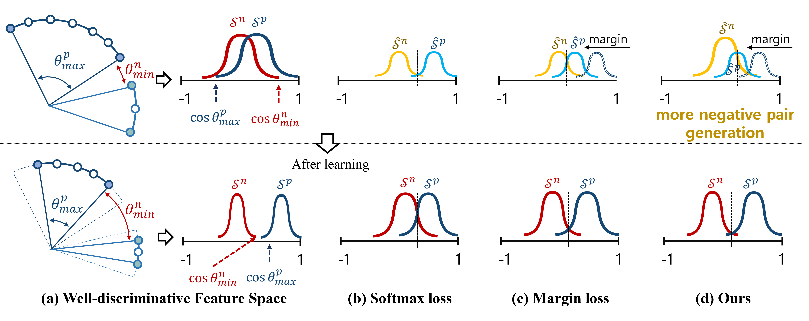
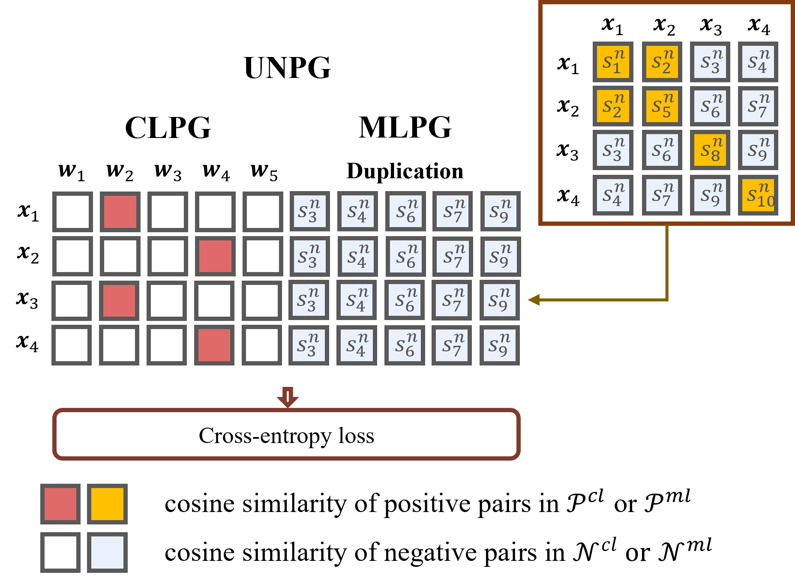

## UNPG
Unified Negative Pair Generation toward
Well-discriminative Feature Space for Face
Recognition


<p align="center">

</p>

## Data prepration

### [MS1MV2](https://arxiv.org/abs/1801.07698)
MS1M-ArcFace (85K ids/5.8M images) [download link](https://github.com/deepinsight/insightface/wiki/Dataset-Zoo)

```bash
#Preprocess 'train.rec' and 'train.idx' to 'jpg'

# example
cd detection

python rec2image.py --include '{path}/face_emore' --output '{path}/MS1MV2'
```

### [K-FACE](https://arxiv.org/abs/2103.02211)
K-FACE [download link](https://github.com/Jung-Jun-Uk/mixface)

```bash
"""
    ###################################################################

    K-Face : Korean Facial Image AI Dataset
    url    : http://www.aihub.or.kr/aidata/73

    Directory structure : High-ID-Accessories-Lux-Emotion
    ID example          : '19062421' ... '19101513' len 400
    Accessories example : 'S001', 'S002' .. 'S006'  len 6
    Lux example         : 'L1', 'L2' .. 'L30'       len 30
    Emotion example     : 'E01', 'E02', 'E03'       len 3
    
    ###################################################################
"""

# example
cd detection

python align_kfaces.py --ori_data_path '/data/FACE/KFACE/High' --detected_data_path 'kface_retina_align_112x112'
```

### IJBB & IJBC
[download link](https://github.com/IrvingMeng/MagFace)

Please apply for permissions from [NIST](https://www.nist.gov/programs-projects/face-challenges) before your usage.

## Evaluation

#### Performance on public benchmark datasets with [ResNet](https://arxiv.org/abs/1512.03385)-100
|Method|IJB-B<br>(1e-5)|IJB-B<br>(1e-4)|IJB-C<br>(1e-5)|IJB-C<br>(1e-4)|MegaFace<br>(Rank-1 acc)|LFW|Path|
|:---:|:---:|:---:|:---:|:---:|:---:|:---:|:---:|
|[Circle-loss*](https://arxiv.org/abs/2002.10857)|-|-|-|93.95|98.50|99.73|-|
|[ArcFace*](https://arxiv.org/abs/1801.07698)|-|94.20|-|95.60|98.35|99.82|-|
|[MagFace*](https://arxiv.org/abs/2103.06627)|90.36|94.51|94.08|95.97|-|**99.83**|-|
|[CosFace](https://arxiv.org/abs/1801.09414)|89.38|94.39|94.42|96.35|99.08|**99.83**|-|
|CosFace+UNPG|90.61|94.99|94.48|**96.39**|**99.27**|99.81|[link](https://koreatechackr-my.sharepoint.com/:u:/g/personal/rnans33_koreatech_ac_kr/EfQrB42yUHlIpy_G-tg7UH4BedVBFywGVRivRTwzkzyeRQ?e=xJ6T48)|
|ArcFace|89.99|94.89|93.93|96.25|98.56|**99.83**|-|
|ArcFace+UNPG|90.57|95.04|94.47|96.33|98.82|**99.83**|[link](https://koreatechackr-my.sharepoint.com/:u:/g/personal/rnans33_koreatech_ac_kr/EZlqt0175BVFmG0VvsnhNc8Bym9e18BHt0mrsDXAuk9eMw?e=h75aWI)|
|MagFace|89.03|93.99|93.30|95.54|98.51|99.81|-|
|MagFace+UNPG|**90.93**|**95.21**|**94.70**|96.38|98.03|99.81|[link](https://koreatechackr-my.sharepoint.com/:u:/g/personal/rnans33_koreatech_ac_kr/EYPx3wZNc3xMkULR7RpIgK0BK0UY_iHs6oZnkg49Xm21sw)|

“*” indicates results from the original paper.

#### Example script

```bash
cd recognition

# example
python evaluation.py --weights 'face.r100.cos.unpg.wisk1.5.pt' --data 'ijbc.yaml' 
# --data (e.g., 'ijbb.yaml', 'bins.yaml')
```

#### Performance on [K-FACE test datasets (Q1-Q4)](https://arxiv.org/abs/2111.01717) with ResNet-34
|Method|Q4<br>(1e-5)|Q4<br>(1e-4)|Q3<br>(1e-5)|Q3<br>(1e-4)|Q2<br>(1e-5)|Q2<br>(1e-4)|Q1<br>(1e-3)|Q1<br>(1e-2)|Path|
|:---:|:---:|:---:|:---:|:---:|:---:|:---:|:---:|:---:|:---:|
|ArcFace|0.05|0.29|2.06|4.40|26.56|41.29|94.00|**100**|-|
|[SN-pair](https://arxiv.org/abs/2111.01717)|3.50|7.21|17.67|21.16|21.93|33.26|91.80|97.60|-|
|[MS-loss](https://arxiv.org/abs/1904.06627)|5.68|8.70|15.15|18.74|38.33|46.64|94.60|99.20|-|
|[MixFace](https://arxiv.org/abs/2111.01717)|7.11|10.92|9.19|22.55|39.09|44.48|97.00|**100**|-|
|Circle-loss|18.08|25.05|33.56|41.54|71.38|77.93|**100**|**100**|-|
|Arc+UNPG|**29.89**|**50.43**|**51.59**|**60.88**|**91.28**|**93.26**|**100**|**100**|[link](https://koreatechackr-my.sharepoint.com/:u:/g/personal/rnans33_koreatech_ac_kr/ETm5sPGktupEj0Om7U9DzmcBjWLR3r-KLK8pf-q-MflvwQ?e=MBE4KG)|

```bash
cd recognition

# example
python evaluation.py --weights 'kface.r34.arc.unpg.wisk1.0.pt' --data 'kface.yaml' 
```

## Training
#### Example script (FACE)
```bash
cd recognition

# example 
python train.py --model 'iresnet-34' --head 'arcface' --unpg_wisk 1.0 --data 'data/face.yaml' --hyp 'data/hyp.yaml' --name 'example' --device 0,1
```

#### Example script (KFACE)
```bash
cd recognition

# example 
python train.py --model 'iresnet-34' --head 'arcface' --unpg_wisk 1.0 --data 'data/kface.yaml' --hyp 'data/hyp.yaml' --name 'example' --device 0,1
```